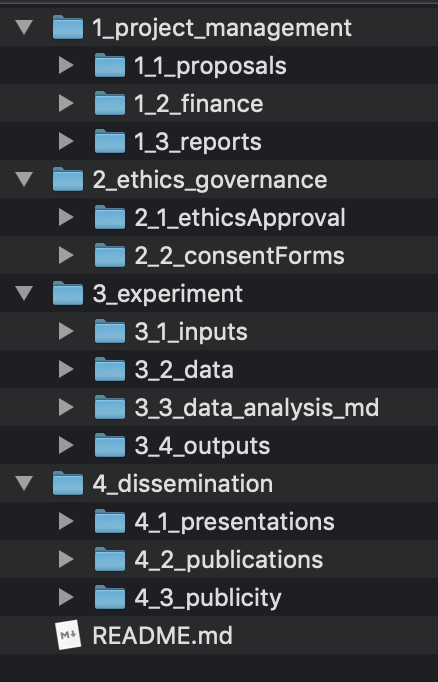

================
Folder Structure
================

The folder structure for the project follows the format illustrated below:

====

--------------------
1_project_management
--------------------

This is not uploaded to git

--------------------
2_ethics_governence
--------------------

This is not uploaded to git

--------------------
3_experiment
--------------------

This is where most of the project lives.

3_1_inputs
-----------
Refers to the tools used to capture information.

This includes:
- Experiment code
    * including all assets (e.g. photos)
- Questionnaires

3_2_data
--------
Raw data lives here.

3_3_data_analysis
-----------------

This includes:
- Scripts for preprocessing and cleaning data
- Processed data
- Scripts for analyzing processed data

3_4_outputs
-----------

This includes:
- Plots

--------------------
4_dissemination
--------------------

Presentations, publications and publicity live here.
